## Introduction

FlowControlXN is an application responsible for monitoring network bandwidth and network traffic analysis. This document describes step by step installation and configuration process of FlowControlXN on VMWare ESXi version 6.5+.

## Additional Resources

For additional resources and information, please visit Passus website at [Passus](https://www.passus.com/#). You may find there:

-   **Documentation:** Documentation and descriptions of our products, available to download in a pdf form, from respective product sites.

-   **Other Passus solutions:** For more solutions available from Passus, visit our homepage and hover the mouse over products drop down menu to view full offer.

## Contact Details

Available ways of contacting Passus SA:

-   **Internet:** To find more products and information please visit our site [Passus](https://www.passus.com/#).

-   **Phone**: In order to contact us via phone we are available under following number: **+48 695 444 803**.

-   **E-mail:** For any queries, please email us at: [mail](mailto:passus@passus.com).

-   **Fax:** Fax available under following number: **+48 100 47 68**

## 1. Installation

This chapter will focus on following aspects of installation process:

-   **Preparation**: Information found here is about what is required to install the virtual machine.

-   **Deployment**: Step by step walkthrough of installation and deployment process of virtual appliance.

### 1.1 Preparation

With purchase of FlowControlXN^TM^, you receive OVA file required for deployment of the software. Please ensure that the file is available for installation process.

**Disclaimer:** FlowControlXN^TM^ is supporting **ESXi 6.5+** version. For the exact software requriements please review Software Requirements section 

**Attention**: Please note that all CPUs should be divided between 2 sockets, e.g for option with 60k FPS, that has 16 CPUs, there will be 8 CPUs per socket.

### 1.2 Deployment

In order to perform the successful installation, please **follow below steps**:

1.  Log in to VMWare ESXi.

2.  From **Navigator Menu** go to **Virtual Machines**. Click on **Create / Register VM**. Pop up window will show up with few steps to be completed.

3.  Select **Deploy a virtual machine from OVF or OVA file**, and then click **Next**.

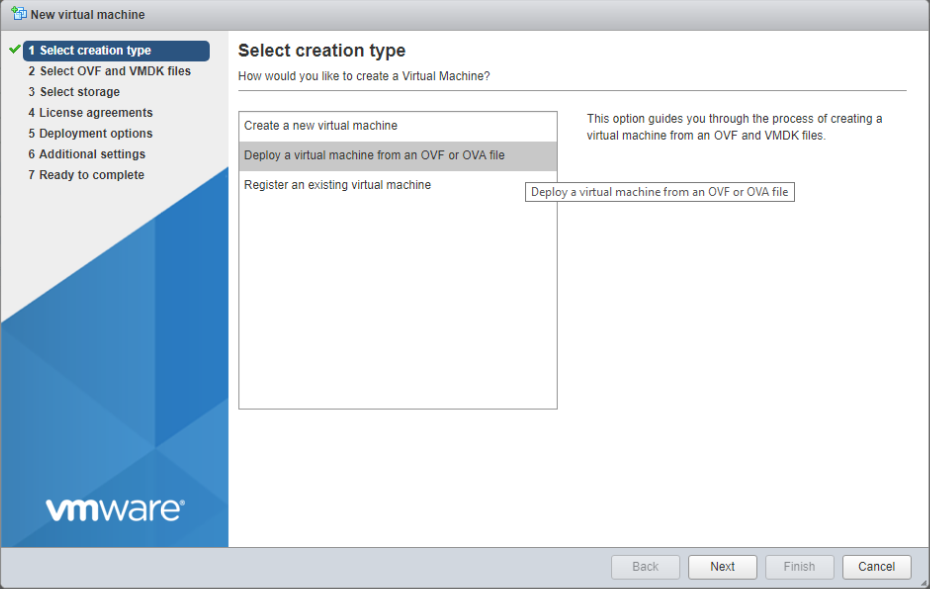

4.  Enter a name of virtual appliance you want to create. Browse the OVA file by clicking on blue parallelogram or drag and drop on it. Click **Next**

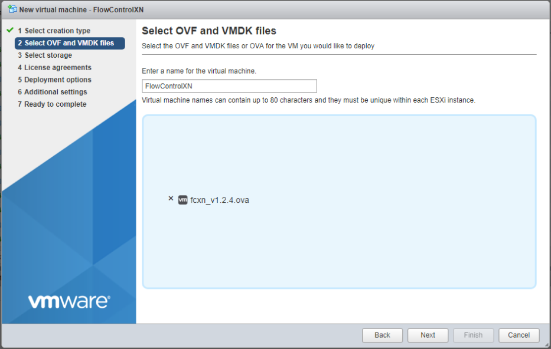

5.  Choose desired datastore that will hold the FlowControlXN files. Click **Next**.

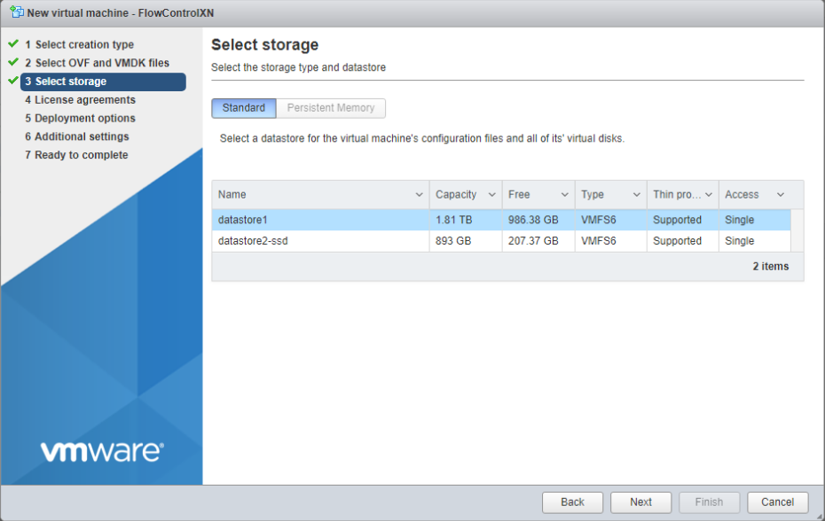

6.  Select data provisioning options depending on your requirements. Make sure that the **Power on automatically** option is deselected. Click **Next**.

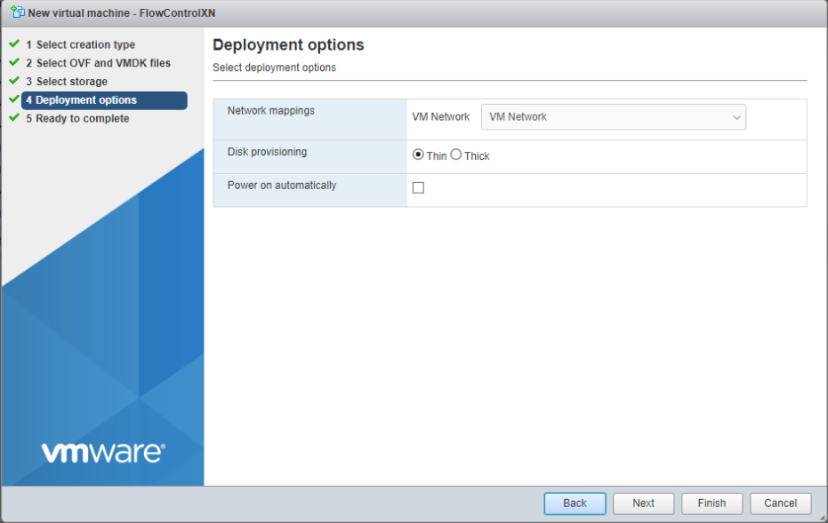

7.  After completing all previous steps, pop up window will show up, summarizing all information about the virtual machine that has been created. Click **Finish** in order to start a deployment process.

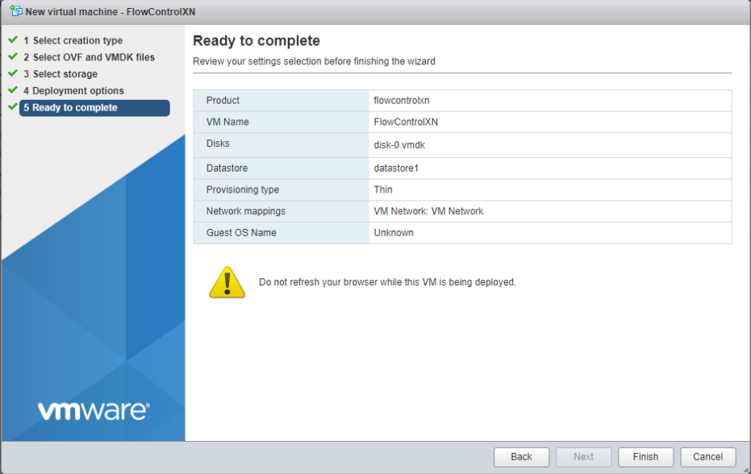

When the deployment process finishes, please give a system 3 - 5 minutes, for it to configure itself. Up till that time it will be unavailable to access.

8.  In order to add second HDD to the virtual machine please go to **Edit settings**. Click on **Add hard disk** drop down menu and choose **New hard disk** from available options.

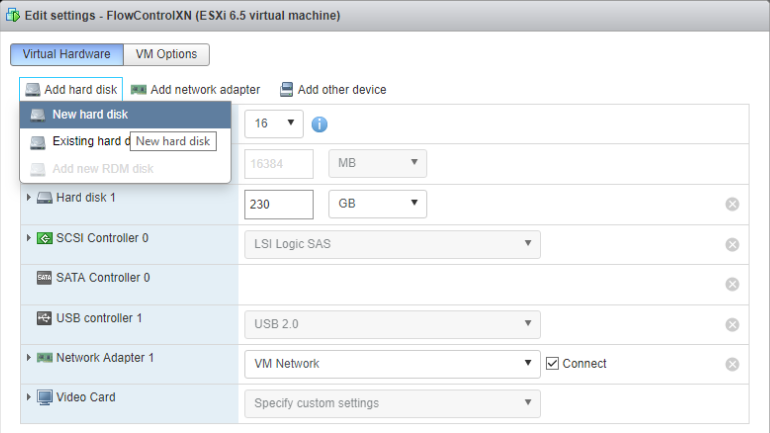

9.  Choosing this option will show window with information to fill in regarding new HDD. Please choose all suitable options for your new hard disk as storage, data provisioning option, etc. Click **Finish** in order to deploy the second HDD.

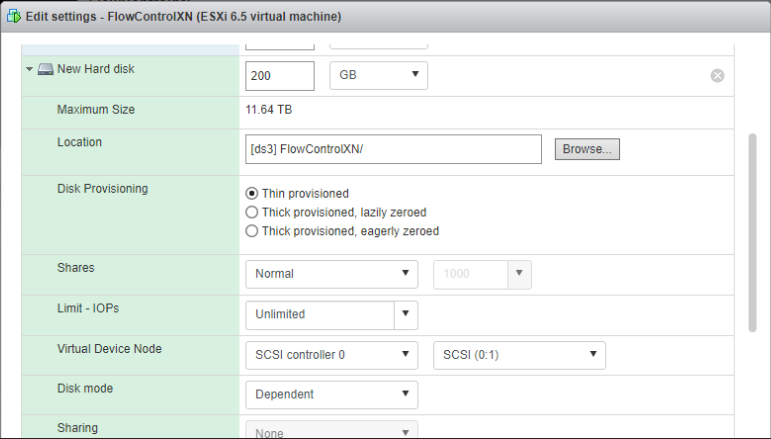

## 2. Configuration 

### 2.1 Adding Archive Disk

If the installation and deployment have been successfully completed, configuration process can be applied. Run the virtual machine that has been created. In order to access the configuration panel press **Left Shift** button 5 times. Cmd console will pop up, there will be command line asking for a password.

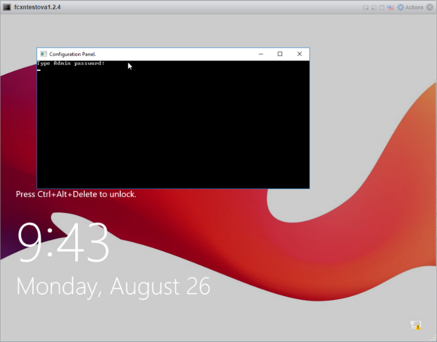

For Admin account, password is: **FcxN12\#\$**. After successful logging in there will be IP Configuration information displayed.

In order to configure the application please type "config" into console and press **Enter**. A question about DHCP will pop up. Please type "yes" for enabling DHCP or "no" for disabling DHCP.

### 2.2 Network Configuration

#### 2.2.1 Enabling DHCP

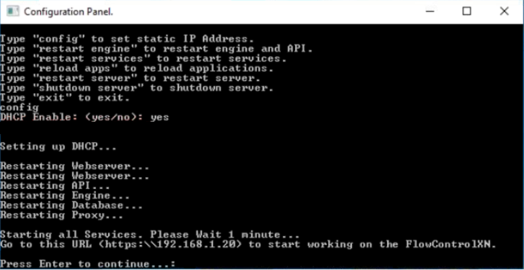

After enabling DHCP server will restart all components and it will give you an information of address which you can enter through web browser in order to access the FlowControlXN^TM^. Press **Enter** to continue.

#### 2.2.2 Disabling DHCP

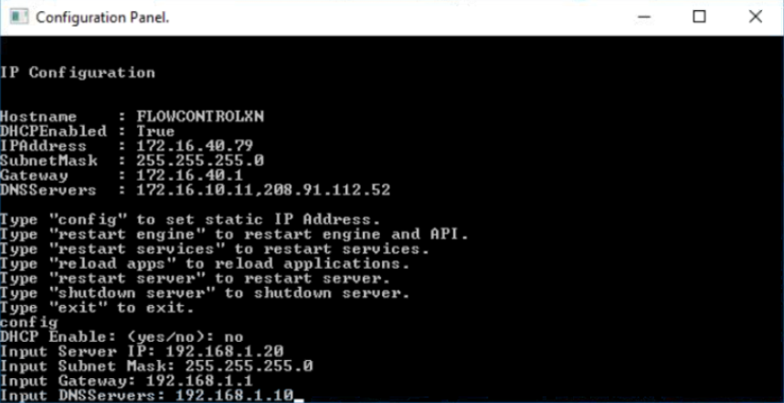

After disabling DHCP program will ask to provide following information: Server IP, Subnet Mask, Gateway and DNS Servers. All information has to be put in manually. After filling in all required addresses press **Enter**. Server will restart all components.

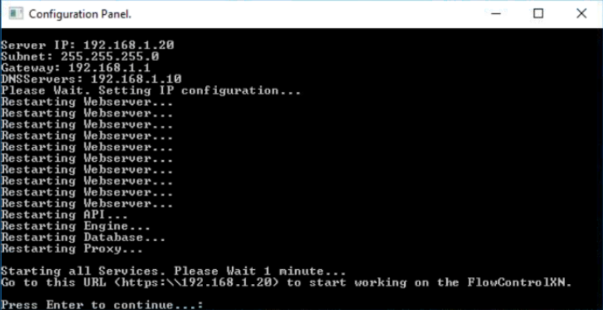

FlowControlXN will be available to access through web browser. Press **Enter** to continue.

### 4. Troubleshooting

After logging in to FlowControlXN^TM^ in the upper right corner there should be visible account name "**admin**". If this is not the case a simple troubleshooting has to be performed:

1.  Access the configuration panel as shown in previous section.

2.  Restart engine by typing in command "restart engine". Wait few moments for system to restart the engine and press **Enter**.

3.  Restart services by typing in command "restart services". Again wait few moments for system to restart all services and press **Enter**.
