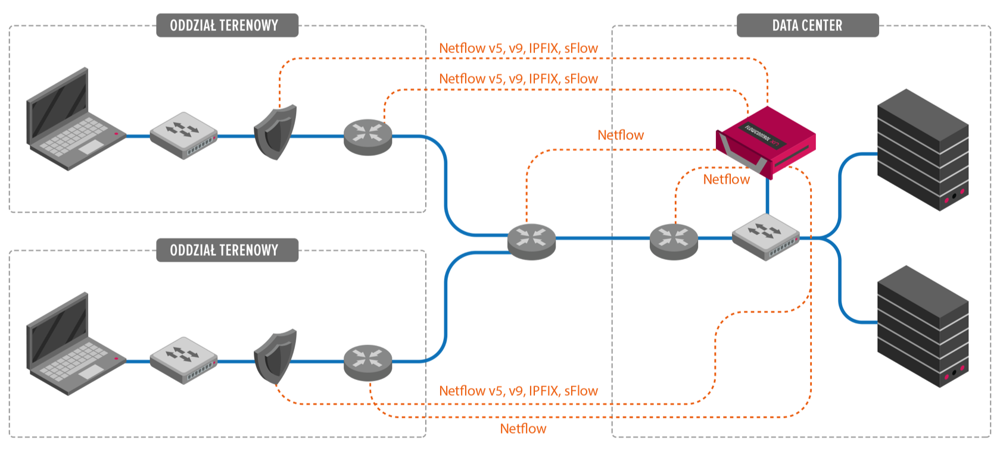
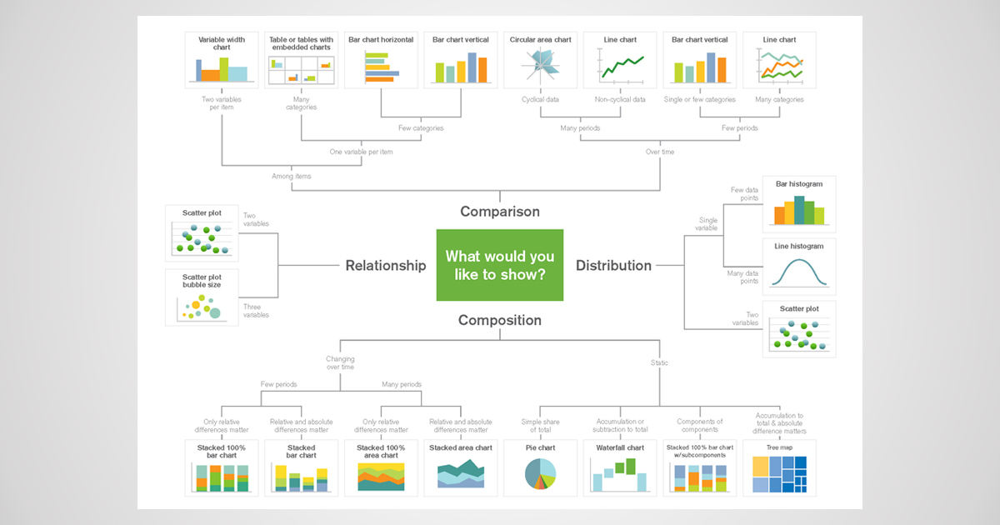
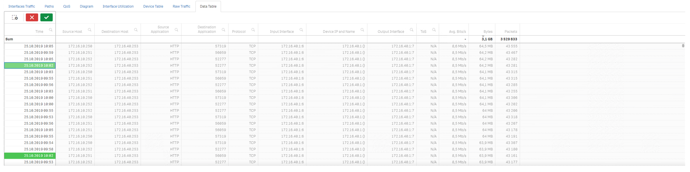

## Introduction

In this document you will find information about most important options available in FlowControl XN and FlowControl XNS. How to operate with data, graphs and charts as well as general description of options available in the system. 

## System Architecture 

> A flow is defined as a unidirectional sequence of packets with some common properties that pass through a network device.  These collected flows are exported to an external device, the NetFlow collector.  Network flows are highly granular; for example, flow records include details such as IP addresses, packet and byte counts,timestamps, Type of Service (ToS), application ports, input and output interfaces, etc.

Source: [RFC3954](https://www.ietf.org/rfc/rfc3954.txt)

According to the RFC3964 FlowControl solution works as a Flow Collector (both hardware and software version is available) which collects, analysies and visualize the collected flows. Metrics are presented and examined from two perspectives : Network and Security giving the operator valuable input into network/application problems analysis as well as security threats hunting. 

FlowControl supports following flow protocol data sources: 

- NetFlow v5, 

- NetFlow v9,

- sFlow, 

- IPFIX,

- NSEL.

> **Note:**Specific options such as NSEL (Cisco ASA) or different sampling multilpiers per device must be additionally configured. System uses SNMP v1/2/3 to query devices. 

## 1. Overview

Main and currently the only option to configure the solution is the web UI. The most important things to notice when working with FlowControl Software is menu on the left-hand side (**Analysis & Presentation options**) and the icons in the top right corner (**Configuration options**). They are all vital components for working with system, effective problem identification and data mining.

### 1.1. Main 

 on the left momsists of three sections: XN, XNS (optional) and SYS. Each section consists of subsections where you can find desired information about collected data and system configuration.  works in hide/meveal mode. In order to show full names of the menu components,please click on the three stripes icon  located at the top left corner. In order to hide menu, same procedure is applied with only exception of the different icon used. 

 

 

Below is presented table with general description of what can be found in each section:

| **FlowControl XN**                                           | Description                                                  |
| ------------------------------------------------------------ | ------------------------------------------------------------ |
|   <b> TOPs </b>  | Information about  top talkers in the network.               |
|     <b> Traffic </b> | Detailed information  about  traffic in the network.         |
|    <b> Applications </b>| Provides the information on applications and its traffic utilization. |
|   <b> Raw Data | Extensive  information about every flow in the traffic.      |
|     <b> ASA Devices </b>| Detailed information about flows from ASA Devices.           |
|    <b> Geolocation  | Maps with various  geolocations.                             |
|   <b> Groups </b>| Flows organized into various groups, e.g business roles, location. |
|     <b> AS Names </b>| Flows organized  according to AS Names.                      |
|    <b> Alerts  </b>| Information and  details about alerts that occured in the network. |
|   <b> Last Day </b>| Aggregated data from  last day.                              |
|  ­   <b> Last Week </b>| Aggregated data from  last week.                             |
|     <b> Last Month </b>| Aggregate data from  last month.                             |

> **Note:** All views but **Raw Data** uses deduplicated traffic. In order to see unique information about flows that may change on flow path, eg. QoS tags – please use **Raw Data** views. 

| **FlowControl XNS**                                          | Description                                           |
| ------------------------------------------------------------ | ----------------------------------------------------- |
|     <b> Security Summary </b>| General overview of security aspects of  the network. |
|    <b> Cockpit Manager </b>| General overview of the basic values of alerts.       |
|      <b> Security Dashboards </b>| Information about alerts and threats in network.      |
|     <b> Threat Intelligence  </b>| Alerts in threat intelligence security  module.       |
|      <b> Threat Detection </b>| Alerts in threat detection security module.           |

 

| **System Section**                                           | Description                                         |
| ------------------------------------------------------------ | --------------------------------------------------- |
|     <b> Flow  Stats </b>| General statistics  about raw and aggregated flows. |
|   <b> System  </b>| Disk utilization information.                       |

### 1.2 Configuration 

At the right-hand side of the system there are three drop-down menus. First one marked with the icon  is settings menu available only for admin accounts. This section is described in Administration Setting paragraph. Second drop-down menu marked with is   available for all users. Things that can be found in this section are :

- License Info,

- User Guide,
- About. 

License  will be automatically downloaded on the user computer as pdf files.User guide will redirect user to the documentation stored on the system. About section system will take user to general web page with information about  [FlowControl](https://www.passus.com/produkty/flowcontrol-xn). 
 Third drop down menu, available for all users, allows to logout from the system. 

### 1.3 Administration Settings

Administrator can change and personalize various aspects of FlowControl environment. Configuration options that can be set up in this menu are all the options required to properly configure and maintan the FlowControl system.

### 1.3.1 Alerts

In the **Alerts** section user can manage and configure customized alerts based on specified metrics threshold.

Configuration of the specific alert consists of three main parts:

- GENERAL -  input Name and Description ,
- FILTERS - specify logical conditions when the alert is triggered,
- NOTIFICATION -  define what whould be the alert delivery mechanism (LOG/SYSLOG/SNMP TRAP or E-MAIL)

System presents all the alerts in a list form where each individual alert can be enabled/disabled, modified or eliminated.

### 1.3.2 Config

In the **Config** section user can configure main system aspects. Options available here are: 

 

- SYSTEM  -  Basic network configuration: Hostname, DNS and IP,

- TIME  - Manual or NTP server configuration,

- USERS  - System user configuration and role assigment,

- NOTIFICATIONS - Email, Syslog and SNMP trap configuration,

- SNMP - SNMP pooling configuration (supported options v1/v2c/v3),

- ASA  - NSEL configuration ,

- LICENSE - License adding option,

- OPERATIONS - Apilication and system restart/shutown options .

 

### 1.3.3 Security

In the **Security** section system allows review and manage security rules created according to the MITRE ATT&CK methodology.

> MITRE ATT&CK™ is a globally-accessible knowledge base of adversary tactics and techniques based on real-world observations. The ATT&CK knowledge base is used as a foundation for the development of specific threat models and methodologies in the private sector, in government, and in the cybersecurity product and service community.

Source: [Mitre](https://attack.mitre.org/)

 Configuration of the security ruleset is based on three sections:

- THREAT DETECTION - Identification of different threats patterns based on proprietary Passus created rules (section allow rule set modification but no rule adding),

- EXTERNAL THREAT INTELLIGENCE - Identification of different threats patterns utilizing several external threat feeds  (section allow rule set modification but no rule adding),

- INTERNAL THREAT INTELLIGENCE - Identification of the custom threats patterns configured by user.

  Alert configuration requires several options to be filled according to MITRE methodology.

### 1.3.4 Mapping

System allows mapping between internal networks into a more comprehensive convention which is then used in data presentation. There are three main sections of the mapping configuration:

- NAMES - we can assign names to the following data objects:
  - Devices - Rule defines NAME for the IP,
  - INTERFACES - Rule defines several aspects of the Device Interface  (Device IP:Interface ID,Interface Name/Description,Interface Speed),
  - HOSTS/SERVERS - Rule defines NAME for Server/HOST IP,
  - APPLICATIONS - Rule defines Name for the custom APPLICATIONS (Protocol/Port Number,Name).

> **Note:** Please remember that in case the NAME or any other parameter exists already and is predefined in the system ex. Application Definitions, mapping will override those values with the user defined ones.

- GROUPS - user can assign names to the internal networks utilizing three grouping sets :
  - LOCATION - grouping based on NETWORK location (CIDR,Name,Description),
  - FUNCTION - grouping based on NETWORK logical function (CIDR,Name,Description),
  - BUSINESS ROLE - grouping based on NETWORK business role in Organization (CIDR,Name,Description).

> **Note:** Grouping is very usefull for presentation purposes as well as for verification of implementation of widely used security zone segmentation concept utilized for both traffic filtering and risk mitigation.

- Locations - user can assign geographic coordinates to following data objects:

  - DEVICES - Rule defines coordinates to DEVICE IP (Device IP,Longitude,Attitude,City,Country,Country Code),

  - HOST/SERVERS - Rule defines coordinates to HOST/SERVER IP (Host/Server IP,Longitude, Attitude, City, Country,Country Code).

    

### 1.3.5 Reports

System is preconfigured with four templates of the reports which can be enabled/disabled on request:

- Security Summary - Summary of detected security threats from last day,
- Network Traffic Report - Overview of top talkers and devices,
- Interface Utilization -  Top interfaces and threshold violations,
- Application Servers - View on the mostly used application servers, 

 Reports are run on a daily basis and the outcome is saved and visible in a list form from the UI.

## 2 Dashboards

This section will cover various aspects of working with selected data. We will divide this section into different aspects that FlowControl uses to interpret data from the network. This will include various graphs, charts and tables as well as best practices how to work with the data. 

### 2.1 Date Range Tab

Important element of the UI is the data range Tab at the top of the page, that stays with the user at all times in both XN and XNS tabs. By default system shows data and statistics for the last 15 minutes after initial login. When starting working on FlowControl it is crucial to remember to change that time range accordingly. In order to make such a change data range tab can be used. 

●   **Keep filters** – switching this option on, allows user to keep the filters and selections while switching between different sections. By default, this option is turned off therefore switching to different section will reset all filters and selections. When enabled filters in different subsection views will be preserved. 

●   **Start date/End date** - choose time slot for which network traffic will be shown. Increasing time slot might influence time of loading data and statistics. 

●   **Last** - this option will change displayed network traffic to the one from chosen time period.

●   **Granulation** – choose for what period of time data will be merged.  

●   **Top flows** - choose how many top flows will be shown. By default, it is 10 000 flows. Increasing flows might influence time of showing data and statistics. 

●   **Search** - specific IPv4 address can be searched for. Every widget will be automatically adjusted to show information only regarding searched IPv4 address.

> **Note:** In order to save our preferences, please click **APPLY** button available at right-hand side. 

 

### 2.2 Data Specific Selection Tab

When creating any selections output of such configuraiton will be shown in a form of tabs. Each individual component of the tab can be managed separately. In order to deselect, press the     button on the tab.

 

  <b> Smart search </b> clicking this option will pop up type in section, where any phrase can be typed in that is being looked for. System automatically suggest options while typing.

  <b> Step back </b> - clicking this option will take a step back in data selections.

  <b>Step forward </b> -  clicking this option will take a step forward in data selections.

  <b> Clear all selections </b> - this option will clear every data selection made.

### 2.3 Visualization Options

System will present the data, metrics and outcome of configured rule set in different graphical form according to the data granularity and metric structure. Presentation layer is configured according to the best practices in the data presentation techniques.

### 2.4 Visualization Drill Down

### 2.4.1 Drill Down Options

Depending on specific dashboard and widget choosen system allow different drill down options.Universal method is clicking over any chart, graph or table where the user will be prompted for:

- **Take snapshot** - allows user to take a snapshot of chosen widget. 

- **Exploration menu** - clicking this option will pop up an exploration menu. This is the place where user can adjust  graph, table or chart to their own needs. Options available to change there are as follows: data to be shown, way of sorting data, presentation of given graph, chart or table, colors and legend.

- **Full screen** - clicking this option, it will take user to the full screen mode of the graph, table or chart. This option is most widely used among mentioned three. This will allow to view more detailed information. In order to exit the full screen mode, press when in full screen mode.

- **Export** - Preconfgured export options:

  - Export as an image,

  - Export to PDF,

  - Export data.

    

In some sections, there is possibility to select data by choosing from drop down menus:

 

System allows user to type in searched phrase or select it from drop down menu. Please remember that depending on the data chosen fields will change color according to the data availability suggesting user which data is alligned with previously.

### 2.4.2 Visual Data Extraction

The first thing to notice when working with  charts is that when you hover your mouse over any bar/data point it will show more details regarding that specific data. 

 

When clicking on bars, they will be selected. You can click on multiple bars in order to view only them on the chart. In order to confirm the selection, please press the green button on the top right corner. If data is presented on multiple elements of the dashboards user selection on one plot will impact data presentation on others accordingly to the selection made.

System does have drop down menus on the left-hand side and at the bottom of the chart (X/Y axes). They can be adjusted (if possible) to show different data types. There is also lasso selection option available in the top right corner    This allows user to draw a line which, when passing through data it will select it accordingly.

Data from graphs can be selected by clicking and dragging just below the x axis, i.e. vertically, to select narrowed, e.g. period of time.

Data can also be selected by clicking and dragging just by the y axis, i.e. horizontally. This will allow to check for the details of highest data used.

### 2.4.3 Exact Values Search

 Tables are the most precise way of presenting data gathered becasue it shows exact values and measures.

 

 

There are two ways of selecting data in tables. First one is by clicking on magnifier icon next to a chosen heading, e.g. Source Host. Drop down menu will pop up where you can either search for desired source host or by simply scrolling down and looking for it manually, then by clicking it. In order to accept the selection, press green button. After making selection, all data will be adjusted. Second option is simply by clicking on desired data in the table. 

 

# 3. System Status 

System provides information about its curent status and performance. Those information are divided in two main sections Flows and System Statistics.

## 3.1 Flows Stats

Sytem actively counts number of raw and deduplicated flows giving the user overview on the current network load of the system. Those information are very useful for proper license sizing of the solution.

 

## 3.2 System Status

Sytem in real time monitors disk space of the application which is crucial for sizing and maintanance of the solution.  Monitored disk space is divied into 3 functional sections:

- Cache, 
- Database,
- System.

 

