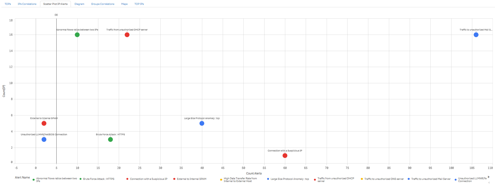
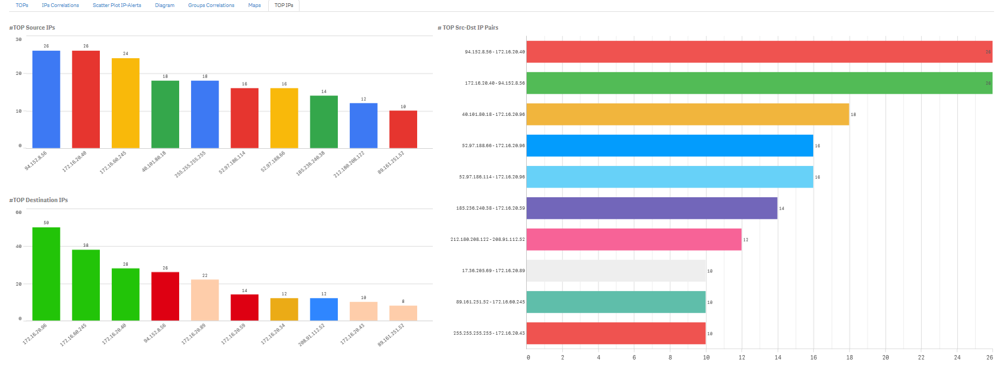

In this document you will find information about most important options available in the FlowControl Security (XNS). The Guide include information how to configure security rules, operate with data, graphs, charts as well as general description of options available in the system.

## Introduction 

FlowControl XNS analyzes and detects network anomaly based on flows from network devices. Thanks to the built-in security rules, the system is able to detect abnormal activities, as well as security threats.

Key product features:

* Detects security threats based on network flows
* Groups security threats according to the **ATT&CK MITRE** framework
* Facilitates security processes (e.g. Network Forensics, Incident Handling, Threat Hunting)
* It is an essential system in every SOC/CSIRT/NOC because improves visibility of network & security anomalies from the entire organization
* Correlates network artifacts indicating on abnormal activities 
* Improves the MTTD KPI through appropriate designed views (e.g. dashboards for SOC/NOC Teams) and effective security rules
* Enriches data by adding valuable information to flows (e.g. ASN, Geolocation, IoC)
* Helps meet regulatory requierements (e.g. CIS Critical Security Controls, ATT&CK MITRE, UoKSC)
* Improves network and security troubleshooting
* Helps to measure KPIs through the Cockpit Manager dashboard
* Integrates with SIEM enabling cross-system correlations.

------

 Mean time to detect (MTTD) - amount of time it takes the Security Team to discover a potential security incident. 

CIS Critical Security Controls - https://www.cisecurity.org/controls/cis-controls-list/

UoKSC (Ustawa o Krajowym Systemie Cyberbezpieczeństwa) http://prawo.sejm.gov.pl/isap.nsf/download.xsp/WDU20180001560/T/D20181560L.pdf

The FlowControl XNS generates security alerts grouped by tactics and techniques of MITRE ATT&CK methodology. Below is a brief description of this methodology.

> MITRE ATT&CK™ is a globally-accessible knowledge base of adversary tactics and techniques based on real-world observations. The ATT&CK knowledge base is used as a foundation for the development of specific threat models and methodologies in the private sector, in government, and in the cybersecurity product and service community.
>
> 

Full MITRE ATT&CK Matrice available on the [MITRE ATT&CK] website. MITRE ATT&CK Matrice contains about 200 techniques  grouped into 12 tactics.

MITRE ATT&CK Tactics:

* Initial Access
* Execution
* Persistence
* Privilege Escalation
* Defense Evasion
* Credential Access
* Discovery
* Lateral Movement
* Collection
* Command and Control
* Exfiltration
* Impact.

Source: [MITRE ATT&CK]( https://attack.mitre.org/ )

Examples of security threats and anomalies detected by the FlowControl XNS:

* D/DoS Attacks
* Malicious Communication (e.g. Malware, C2, Botnet)
* Security Policy Violations (e.g. TOR, Open Proxy, Open DNS, Connections to Unauthorized Services, Using Cleartext Applications)
* Brute Force Attacks
* Network scans (Horizontal and Vertical)
* Network Anomaly (Activity on Suspicious Ports, Abnormal Flows Traffic between Hosts, Large Size Protocol )
* Virus Outbreak.

## 1. Overview

Flow Control XNS analyze network flows to detect suspicious activity.

> A flow is defined as a unidirectional sequence of packets with some common properties that pass through a network device.  These collected flows are exported to an external device, the NetFlow collector.  Network flows are highly granular; for example, flow records include details such as IP addresses, packet and byte counts,timestamps, Type of Service (ToS), application ports, input and output interfaces, etc.

Source: [RFC3954](https://www.ietf.org/rfc/rfc3954.txt)

The system supports the following flow protocol data sources: 

- NetFlow v5
- NetFlow v9
- sFlow
- IPFIX
- NSEL.

> **Note:**Specific options such as NSEL (Cisco ASA) or different sampling multilpiers per device must be additionally configured. System uses SNMP v1/2/3 to query devices. 

According to the RFC3964 FlowControl solution works as a Flow Collector (both hardware and software version is available) which collects, analysies and visualize the collected flows. Metrics are presented and examined from two perspectives : Network and Security giving the operator valuable input into network/application problems analysis as well as security threats hunting. 

FlowControl XNS consist of two modules: 

* Threat Detection (TD)

* Threat Intelligence (TI). 

The Threat Intelligence Engine analyze flows in context of reputation databses to detect malicious or illegal activity. However, The Threat Detection analyze many attributes within a specified period of time to detect network anomalies and security threats. 

The FlowControl has many extensive views to help detect and analyze security incidents.
More details about them you can find in the following sections.

### 1.1. Security Summary Dashboard

The Security Summary Dashboard concerns security alerts from both engines (TI and TD). It concists of five views.

| View Name          | Description                                                  |
| ------------------ | ------------------------------------------------------------ |
| Alerts Graph       | A graph showing relationships between some attributes, such as Tactic, Technique, Alert Name, Source and Destination Host of security alerts. |
| Alerts             | A table with all security alerts.                            |
| Alerts Drilldown   | A view allowing for analyzing security alerts grouped by such attributes as Severity, Tactic, Technique, Threat Category, Alert Name, Source Host, Destination Host, Application, Direction, Source Group, Destination Group. Presenting threats in the context of these attributes facilitates an effective review of organizational security risks. |
| Alerts Statistics  | A set of charts displaying statistics on detected security threats, such as number of alerts per severity or number of alerts per security module. |
| TOP Suspicious IPs | A view that displays the most suspected hosts in the organization. |

*[Views of Security Summary Dashboard]*

*[Security Dashboard - Alerts Graph]*

*[Security Dashboard - Alerts]*

*Security Dashboard - Alerts Drilldown*

*[Security Dashboards - TOP Suspicious IPs]*

*[Security Dashboards - Alerts Statistics]*

### 1.2. Manager Cockpit

The cockpit show number of alerts per severity and set of KPIs shown in the below table.

| KPI                         | Description                                                  |
| --------------------------- | ------------------------------------------------------------ |
| %High and Critical Alerts   | An indicator showing the percentage of high and critical alerts relative to all alerts in the last week. |
| %Security Module            | An indicator showing the percentage of TI and TD alerts in the last week. |
| Internal Suspicious Src IPs | An indicator showing the number of unique suspicious IPs.    |
| Internal Suspicious Dst IPs | An indicator showing the number of unique internal suspicious hosts in compariston to hosts having at least one high category alert in the analyzed time period. |

*[Manager Cockpit - KPIs]*

### 1.3. Security Dashboards

Security Summary Dashboard show all security alerts in many context allowing for quick and effective analysing security alerts.

| View                   | Description                                                  |
| ---------------------- | ------------------------------------------------------------ |
| TOPs                   | A view showing statistics of security alerts, such as for example Unique SrcIP per Alerts or TOP Source Countries. |
| IPs Correlations       | A view showing relationships between alerts and IP addresses in the context of detected threats. |
| Scatter Plot IP-Alerts | A scatter plot showing number of IPs related to security alerts. |
| Diagram                | A view allowing for analyzing security alerts grouped by such attributes as Severity, Tactic, Technique, Threat Category, Alert Name, Source Host, Destination Host, Application, Direction, Source Group, Destination Group. Presenting threats in the context of these attributes facilitates an effective review of organizational security risks. |
| Groups Correlations    | A view showing relationships between threat categories and groups in the context of detected threats. |
| Maps                   | A view showing suspicious activities detected by FlowControl in the context of public IP addresses on the world map. For the readability of the graph, the blue dot specifies the number of Bytes. |
| TOP IPs                | A view that displays charts regarding TOP Source IPs, TOP Destination IPs and TOP Src-Dst IP Pairs. |

*[Views of Security Summary Dashboard]*

*[Security Dashboard - TOPs]*

*[Security Dashboard - IPs Correlations]*

*[Security Dashboard - Scatter Plot IP]*

*[Security Dashboard - Diagram]*

*[Security Dashboard - Groups Correlations]*

*[Security Dashboard - Maps]*

*[Security Dashboard - TOP IPs]*

## 2. Threat Detection 

The Threat Detection module generates alerts based on correlations of relevant attributes sent in network flows indicating on a potential security issues. The TD engine has 38 security rules for seven tactics and twelve techniques of MITRE ATT&CK.

### 2.1. Initial Configuration

All Threat Detection rules are disabled by default to reduce the number of False Positives. At the initial stage of implementation FCXNS module, you should tune security rules in the field of configurable attributes, groups and whitelists.

### 2.2. Threat Detection Rules

This section describes all the rules triggered by the TD engine.

| Name                                                         | Score | Description                                                  | MITRE Tactic         | MITRE Technique                         |
| ------------------------------------------------------------ | ----- | ------------------------------------------------------------ | -------------------- | --------------------------------------- |
| Connection to a Clear Text Application between External hosts | 4     | A rule  detects connection to a clear text application such as for example FTP,  Telnet, POP3, IMAP, SMTP, IMAP, HTTP from External to External host. Many  regulations, such as for example EU's General Data Protection Regulation  (GDPR) or PCI Data Security Standard (PCI DSS) prohibit sending sensitive  (e.g. passwords, credit card numbers, health records, personal information  and business secrets data) in plain text or unencrypted protocols. For the  rule to work correctly, configure the Whitelist groups. | Command  And Control | Standard  Application Layer Protocol    |
| Connection to a Clear Text Application from External to Internal  host | 4     | A rule  detects connection to a clear text application such as for example FTP,  Telnet, POP3, IMAP, SMTP, IMAP, HTTP from External to Internal host. Many  regulations, such as for example EU's General Data Protection Regulation  (GDPR) or PCI Data Security Standard (PCI DSS) prohibit sending sensitive  (e.g. passwords, credit card numbers, health records, personal information  and business secrets data) in plain text or unencrypted protocols. For the  rule to work correctly, configure the Whitelist groups. | Command  And Control | Standard  Application Layer Protocol    |
| Connection to a Clear Text Application from Internal to External  host | 4     | A rule  detects connection to a clear text application such as for example FTP,  Telnet, POP3, IMAP, SMTP, IMAP, HTTP from Internal to External host. Many  regulations, such as for example EU's General Data Protection Regulation  (GDPR) or PCI Data Security Standard (PCI DSS) prohibit sending sensitive  (e.g. passwords, credit card numbers, health records, personal information  and business secrets data) in plain text or unencrypted protocols. For the  rule to work correctly, configure the Whitelist groups. | Command  And Control | Standard  Application Layer Protocol    |
| Connection to a Clear Text Application between Internal hosts | 4     | A rule  detects connection to a clear text application such as for example FTP,  Telnet, POP3, IMAP, SMTP, IMAP, HTTP from Internal to Internal host. Many  regulations, such as for example EU's General Data Protection Regulation  (GDPR) or PCI Data Security Standard (PCI DSS) prohibit sending sensitive  (e.g. passwords, credit card numbers, health records, personal information  and business secrets data) in plain text or unencrypted protocols. For the  rule to work correctly, configure the Whitelist groups. | Command  And Control | Standard  Application Layer Protocol    |
| Activity on a Suspisious Port - Blacklist                    | 4     | A  rule detects traffic to a single host on suspicious ports. Suspicious ports  are all ports defined in Suspicious Ports list. This activity may indicate on  presence threat actors in an organization. For the rule to work correctly,  update the list of Suspicious Ports and configure Flow Count and Whitelist  attributes. | Command  And Control | Uncommonly  Used Port                   |
| Activity on a Suspisious Port - Whitelist                    | 4     | A  rule detects traffic to a single host on suspicious ports. Suspicious ports  are all ports not defined on the Permitted Ports list. For the rule to work  correctly, update the list of permitted ports and configure Flow Count and  Whitelist attributes. | Command  And Control | Uncommonly  Used Port                   |
| Brute Force Attack                                           | 5     | A rule  detects a brute force/dictionary attack on specific applications (FTP, HTTPS,  HTTP, IMAP, RDP, SSH, IMAP3, LDAP, LDAPS, MYSQL, POP3, POP3S, POSTGRESQL,  SMTP, TELNET, TFTP, ASTERISK, VNC, SNMP, MSSQL, SMB, ICQ, NNTP, PCANYWHERE,  ORACLELISTENER, SVN, XMPP, SIP, RADMIN2, REXEC, RLOGIN, WS - Management and  PowerShell remoting via HTTP, WS - Management and PowerShell remoting via  HTTPS, RPCAP, NetBIOS, Kerberos). For the rule to work correctly, configure  the Port Threshold List in the format Flows_Threshold\|Port\|Service_Name, and  Whitelist groups. | Credential  Access   | Brute  Force                            |
| Unauthorized LLMNR/NetBIOS Connection                        | 5     | A  rule detects unauthorized LLMNR/NetBIOS traffic.;Link-Local Multicast Name  Resolution (LLMNR) and NetBIOS Name Service (NBT-NS) are Microsoft Windows  components that serve as alternate methods of host identification. Attacker  may spoof an authoritative source for name resolution on a victim network by  responding to LLMNR (UDP 5355)/NBT-NS (UDP 137) traffic as if they know the  identity of the requested host, effectively poisoning the service so that the  victims will communicate with the adversary controlled system. More details:  MITRE T1171. For the rule to work correctly, configure the LLMNRAndNetBIOS  Group. | Credential  Access   | LLMNR/NBT-NS  Poisoning and Relay       |
| Abnormal flows ratios between two IPs                        | 4     | A rule  detects abnormal number of flows per Source & Destination IPs pairs  within 1 minute. The reasons for this activity can be worms, scans or network  abuses. For the rule to work correctly, configure the Flow Count attribute  and Whitelist groups. | Discovery            | System  Network Configuration Discovery |
| Horizontal Scan                                              | 4     | A  rule detects a Horizontal Scan attack. The Horizontal Scan is a scan against  a group of IPs for a single port. For the rule to work correctly, configure a  Port Threshold List in a format Flows_Threshold\|Port\|Service and Whitelist  groups. | Discovery            | Network  Service Scanning               |
| Access to Internet from non-permitted group                  | 4     | A  rule detects access to Internet from non-permitted group based on definied  zones. This type of activity may indicate on a security policy violation. For  the rule to work correctly, configure the Permitted Groups. | Discovery            | Permission  Groups Discovery            |
| Traffic from unauthorized DHCP server                        | 4     | A  rule detects traffic from unauthorized DHCP server. Unauthorized DHCP servers  can cause many network issues by allocating incorrect configurations to  client. From the security point of view, this type of activity may indicate  presence a rogue DHCP server. For the rule to work correctly, configure the  DHCP SERVERS groups. | Discovery            | System  Network Configuration Discovery |
| Traffic to unauthorized DNS server                           | 4     | A  rule detects traffic from unauthorized DNS server. This type of activity may  indicate on unauthorized changes of DNS settings on infected host. For the  rule to work correctly, configure the DNS SERVERS groups. | Discovery            | System  Network Configuration Discovery |
| Vertical Scan Detected                                       | 4     | A  rule detects a Vertical Scan attack. A Vertical Scan is a scan against a  single IP for multiple ports. The number of ports is configurable in the  "# of ports scanned threshold" parameter. For the rule to work  correctly configure the Whitelist groups as well. | Discovery            | Network  Service Scanning               |
| Traffic to unauthorized Mail Server                          | 4     | A  rule detects traffic from unauthorized Mail Server. This type of activity may  indicate on a security policy violation. For the rule to work correctly,  configure the Mail Servers Whitelist groups. | Discovery            | System  Network Configuration Discovery |
| Virus Outbreak                                               | 4     | A  rule detects a potential virus outbreak based on abnormal activity between  hosts from Workstation group. This activity may indicate on virus outbreak in  the organization. For the rule to work correctly, configure the following  attributes: Uniqe Hosts Count and Workstation group. For the rule to work  correctly, configure the Port Threshold List in the format  Flows_Threshold\|Port\|Service_Name, and Whitelist groups. | Discovery            | Network  Service Scanning               |
| Abnormal DNS Query Limit                                     | 5     | A  rule detects anomaly in DNS protocol regarding abnormal query volume traffic.  This rule will be triggered after detecting many DNS queries from the same  IP. This activity may indicate on connections to C2 master severs. For the  rule to work correctly, configure the Query Limit and Whitelist groups. | Exfiltration         | Data  Transfer Size Limits              |
| Abnormal DNS Response Limit                                  | 5     | A  rule detects anomaly in DNS protocol regarding abnormal response volume  traffic. This rule will be triggered after detecting many DNS queries to the  same IP. This activity may indicate on malware activity over DNS. For the  rule to work correctly, configure the Response Limit and Whitelist groups. | Exfiltration         | Data  Transfer Size Limits              |
| DNS Transfer Limit                                           | 5     | A  rule detects anomaly in DNS protocol regarding abnormal query volume traffic.  This activity may indicate on connections to C2 master severs. For the rule  to work correctly, configure the Transfer Limit and Whitelist groups. | Exfiltration         | Data  Transfer Size Limits              |
| High Data Transfer Rate from Internal to External Host       | 5     | A  rule detects a high data transfer from internal to external host within 1  minute. This type of activity may indicate on a security policy violation,  e.g. exfitration sensitive data. For the rule work correctly, configure the  Low and High Thresholds, which are given in Megabytes. | Exfiltration         | Data  Transfer Size Limits              |
| High Data Transfer Rate from External to Internal Host       | 5     | A  rule detects a high data transfer from external to internal host within 1  minute. This type of activity may indicate on a security policy violation.  For the rule to work correctly, configure the Low and High Thresholds, which  are given in Megabytes. | Exfiltration         | Data  Transfer Size Limits              |
| High Data Transfer Rate Between Internal Hosts               | 5     | A  rule detects a high data transfer from internal to internal host within 1  min. This type of activity may indicate on a security policy violation. For  the rule to work correctly, configure the Thresholds which are given in  Megabytes. | Exfiltration         | Data  Transfer Size Limits              |
| Unusually High Data Transfer Rate from Internal to External Host | 5     | A  rule detects a high data transfer from internal to external host within 1  minute. A reasons for this type of activity may be unauthorized data  exfiltration outside the organization. For the rule work correctly, configure  the Low Threshold which is given in Megabytes. | Exfiltration         | Data  Transfer Size Limits              |
| Unusually High Data Transfer Rate from External to Internal Host | 5     | A  rule detects a high data transfer from external to internal host within 1  minute. This type of activity may indicate on a security policy violation.  For the rule work correctly, configure the Low Threshold which is given in  Megabytes. | Exfiltration         | Data  Transfer Size Limits              |
| Large Size Protocol Anomaly                                  | 5     | A  rule detects packets of known protocols (ICMP, UDP, TCP) with large size  which may indicate on protocol attacks. For the rule to work correctly,  configure the following attributes: Flow Count, and BPF (Bytes per Flow) for  each IP Protocol. | Exfiltration         | Data  Transfer Size Limits              |
| External to Internal SPAM                                    | 5     | A  rule detects a SPAM traffic from External to Internal host. An external host  is sending excessive email traffic to the organization. For the rule to work  correctly, configure the following attributes: Flow Count, PPF (Packets per  Flow). | Exfiltration         | Data  Transfer Size Limits              |
| External to External SPAM                                    | 5     | A  rule detects a SPAM traffic between External hosts. An external host is  sending excessive email traffic to the organization. For the rule to work  correctly, configure the following attributes: Flow Count, PPF (Packets per  Flow). | Exfiltration         | Data  Transfer Size Limits              |
| Internal to External SPAM                                    | 5     | A  rule detects a SPAM traffic from Internal to External host. An internal host  may be infected with a spam malware. For the rule to work correctly,  configure the following attributes: Flow Count, PPF (Packets per Flow). | Exfiltration         | Data  Transfer Size Limits              |
| Exfiltration: Internal to Internal SPAM                      | 5     | A  rule detects a SPAM traffic between Internal hosts. An internal host may be  infected with a spam malware. For the rule to work correctly, configure the  following attributes: Flow Count, PPF (Packets per Flow). | Exfiltration         | Data  Transfer Size Limits              |
| DDoS Attack Detected                                         | 8     | A rule  detects DDoS attack based on traffic volume from multiple IP addresses to a  single destination IP on the same port. The attack involves saturating  network resources causing disruption of normal traffic on the target server.  For the rule to work correctly, configure the Counter Threshold and Whitelist  groups. | Impact               | Endpoint  Denial of Service             |
| D/DoS Attack Detected - Signature 2                          | 8     | A rule  detects anomalies in network traffic based on a comparison of specific  indicators over a 60-minute interval. The D/DoS attack against a server is  detected based on many attributes. For the rule to work correctly configure  the Groups Threshold in a format:  Group,Unique_ASNs,Unique_IPs,Unique_Internal_IPs,Unique_Public_IPs,Flows,Packets,Bytes,PPF,BPP,BPF,Flows_Limit,Bytes_Limit,Unique_IPs_Limit,Indicators_Limit.  The first 10 attributes are behaviorally computable, and the configured value  means a multiplier (e.g. 2 means 2 times). The next 4 attributes are static. | Impact               | Endpoint  Denial of Service             |
| DDoS DNS Amplification Attack - Signature 1                  | 8     | A rule  detects DDoS DNS Amplification Attack based on network traffic statistics  (Signature 1). To create heavy traffic, an attacker send a request in a way  that generates the largest possible response from DNS name resolution  services. As a result, the target receives reinforcement of the initial  attacker's traffic, and their network is clogged with false traffic, which  causes denial of service. For the rule to work correctly, configure the  following attributes: Flow Count and PPF (Packets Per Flow). | Impact               | Endpoint  Denial of Service             |
| DoS Attack Detected                                          | 8     | A  rule detects DoS attack based on traffic volume from one IP address to single  IP on specific port. For the rule to work correctly, configure the Port  Threshold List in a format: Flows_Threshold\|Port\|Service and Whitelist  groups. | Impact               | Endpoint  Denial of Service             |
| DoS - ICMP Flood                                             | 8     | A  rule detects the DoS ICMP attack. An attacker can send a large number of ICMP  packets to consume all available bandwidth of an victim's host. For the rule  to work correctly, configure the following attributes: Flow Count, PPF  (Packets per Flow), PPM (Packets Per Minute) and Whitelist groups. | Impact               | Endpoint  Denial of Service             |
| DoS - TCP Flood                                              | 8     | A  rule detects TCP DoS attack. An attacker can send a large number of TCP  packets to one or several ports of the victim, which eventually renders the  attacked host unable to process the incoming packets. For the rule to work  correctly, configure the following attributes: Flow Count, PPF (Packets per  Flow), PPM (Packets Per Minute) and Whitelist groups. | Impact               | Endpoint  Denial of Service             |
| DoS - UDP Flood                                              | 8     | A  rule detects the DoS UDP attack. An attacker can send a large number of UDP  packets to consume all available bandwidth of the victim's host. For the rule  to work correctly, configure the following attributes: Flow Count, PPF  (Packets per Flow), PPM (Packets Per Minute) and Whitelist groups. | Impact               | Endpoint  Denial of Service             |
| P2P Activity                                                 | 2     | A  rule detects P2P traffic based on port analysis. This activity may indicate  on a policy violation. For the rule to work correctly, configure the P2P Port  Ranges in a format StartPort,EndPort,protocol,P2P_Name,Description and a  Whitelist groups. | Initial  Access      | Drive-by  Compromise                    |
| Unauthorized RDP Connection                                  | 6     | A  rule detects unauthorized RDP connection attempts from outside the  organization. An attacker may connect to a remote system over RDP to expand  access if the service is enabled. For the rule to work correctly, configure  the Authorized RDP Servers groups. | Lateral  Movement    | Remote  Desktop Protocol                |

*List of Threat Detection Rules*

### 2.3. Threat Detection Dashboards

 **The Alerts Drilldown** view allows for analyzing security alerts grouped by such attributes as Severity, Tactic, Technique, Alert Name, Source Host, Destination Host, Direction, Source Group and Destination Group. Presenting threats in the context of these attributes facilitates an effective review of organizational security risks.

*TD Alerts Drilldown*

Information about the country associated with the threat is very useful for the security module to know which countries are involved in this type of security threat. To better visualize the situational view of this case, use the **Suspicious Country** view.

*TD Suspicious Countries*

Another view showing interesting statistics on the number of unique IP addresses in the context of alert names and categories is **the Alert Statistcs** view.

*TD Alerts Statistics*

**The TOPs** view shows information about the most common feeds, alert names, threat categories, as well as IP address pairs in the context of all TD threats. The view is ideally suited as the first starting point for analysis to detect repetitive attacks and ignore False Positives.

*TD TOPs*

Another view on TD threats is provided by the **IPs Correlation** graph, which graphically presents source and destination IP addresses in the context of specific threats. A quick look at this view enables the network and security analyst to analyze security anomalies. It enables the presentation of security anomalies from the perspective of the entire organization, and can also be considered as a reason to make a decision about tuning security rules.

*TD IPs Correlations*

**The Maps** view shows suspicious activities detected by FlowControl in the context of public IP addresses on the world map. For the readability of the graph, the blue dot specifies the number of GBs sent by source country.

*TD Maps*

A quick look at the basic information about attacks detected by TD engine is provided by the **Alerts** tab.

*TD Alerts*

## 3. Threat Intelligence

FlowControl XNS includes update regularly more than 30 external reputation databases.
Threat Intelligence module generates information about suspicious connections based on correlations with blacklists of malicious IP addresses and suspicious countries. 

This module is divided into two parts: 

* External Threat Intelligence, which uses automatically updated feeds downloaded from Internet
* Internal Threat Intelligence, which uses manually created and updated feeds.

The TI Module generates the following alerts:

* Connection with Suspicious IP
* Connection with Suspicious Country
* Connection with Open Proxy
* Connection with Open DNS
* Connection with TOR.

A system admin can create and modify the Internal TI feeds.

| Feed Id                   | Name                                | Category  | Score | Description                                       | MITRE Tactic         | MITRE Technique                      |
| ------------------------- | ----------------------------------- | --------- | ----- | ------------------------------------------------- | -------------------- | ------------------------------------ |
| Niebezpiecznik_custom     | Connection with  Suspicious IP      | Malicious | 9     | Custom Feed -  Niebezpiecznik.                    | Command And  Control | Standard  Application Layer Protocol |
| ThreatIntelligence_custom | Connection with  Suspicious IP      | C2        | 2     | Internal Threat  Intelligence - Custom Feed.      | Command And  Control | Standard  Application Layer Protocol |
| OpenDNS_custom            | Connection with  Open DNS           | Open DNS  | 3     | Open DNS - Custom  feed created manually.         | Command And  Control | Standard  Application Layer Protocol |
| WhitelistIP_whitelist     | Exception                           | Exception | 4     | IP Whitelist                                      | Command And  Control | Standard  Application Layer Protocol |
| Country_custom            | Connection with  Suspicious Country | Botnet    | 6     | The Worst Botnet  Countries based on custom list. | Command And  Control | Standard  Application Layer Protocol |

*Internal Threat Intelligence Feeds*

### 3.1. Initial Configuration

FlowControl XNS requires access to the Feeds URLs. Please contact the Support Team during configuring the module.

### 3.2. Configuring Threat Intelligence (TI)

To modify the Threat Intelligence module, you must be logged in to the system admin account, then enter the **Settings** tab. After clicking the **Security** option, all security modules will be displayed. Click on the selected security module to edit or modify it. In the case of the TI module there are two tabs [External Threat Intelligence]:

* External Threat Intelligence

* Internal Threat Intelligence.

  

*External Threat Intelligence*

The External Threat Intelligence rules contain attributes that are described in Table [External Threat Intelligence Feeds Attributes].

| Attribute          | Description                                                  | Possible Values                                              | Modifiable                                                   |
| ------------------ | ------------------------------------------------------------ | ------------------------------------------------------------ | ------------------------------------------------------------ |
| Enabled            | The  attribute indicates the status of the rule. Disabled rules do not generate  security alerts. | Enabled     Disabled                                         |    |
| Alert Name         | The  attribute indicating the name of the rule.              | Connection  with a Suspicious IP,    Connection with a Suspicious Country, Connection with Open Proxy,  Connection with TOR |  |
| Feed Id            | The  attribute indicating the Feed Id for each rule. Each rule has a unique value  of the Feed Id attribute. |                                                              |  |
| Data Type          | The  attribute indicating the type of collected data for each feed. | IP, Country                                                  |  |
| Threat  Category   | The  attribute indicating the category of feed related to type of security  threats. | Bot, Botnet, C2, Feodo, Malicious     Malware, Open Proxy, Ransomware, Rogue DNS, SNMP BL, SSH BL,  Telnet BL, TOR, Zeus |  |
| MITRE Tactic       | The  attribute indicating the MITRE Tactic related to a security rule. | Initial  Access,  Execution, Persistence, Privilege Escalation,    Defense Evasion,  Credential Access     Discovery, Lateral Movement     Collection, Command and Control,    Exfiltration, Impact |  |
| MITRE  Technique   | The  attribute indicating the MITRE Technique related to a security rule.  There is about about 200 techniques - more details https://attack.mitre.org/matrices/enterprise/. |                                                              |  |
| Score              | Attribute  indicating the importance of the feed on a scale of 1 to 10. | {1..10}                                                      |  |
| Refresh  Interval  | Attribute  indicating the time interval, how often (in minutes) the feed should be  updated. | {0..32767}                                                   |  |
| Last Refresh  Time | Attribute  indicating the last feed update in format YYYYMMDDhhmm. |                                                              |  |
| Alert  Description | Attribute  indicating the description of the feed.           |                                                              |  |

*External Threat Intelligence Feeds Attributes*

*Example of Internal Threat Intelligence Feed [Dan_TOR]*

The Internal Threat Intelligence engine correlates custom feeds in context of network flow. All attributes except Alert Name can be modified in it. 

| Attribute          | Description                                                  | Possible Values                                              | Modifiable                                                   |
| ------------------ | ------------------------------------------------------------ | ------------------------------------------------------------ | ------------------------------------------------------------ |
| Enabled            | The  attribute indicates the status of the rule. Disabled rules do not generate  security alerts. | Enabled     Disabled                                         |    |
| Alert Name         | The  attribute indicating the name of the rule. The attribute can be set only once when creating a new custom feed. |                                                              |  |
| Feed Id            | The  attribute indicating the Feed Id for each rule. Each rule has a unique value  of the Feed Id attribute. |                                                              |    |
| Data Type          | The  attribute indicating the type of collected data for each feed. | IP, Country                                                  |    |
| Threat  Category   | The  attribute indicating the category of feed related to type of security  threats. | Bot, Botnet, C2, Feodo, Malicious     Malware, Open Proxy, Ransomware, Rogue DNS, SNMP BL, SSH BL,  Telnet BL, TOR, Zeus |    |
| MITRE Tactic       | The  attribute indicating the MITRE Tactic related to a security rule. | Initial  Access,  Execution, Persistence, Privilege Escalation,    Defense Evasion,  Credential Access     Discovery, Lateral Movement     Collection, Command and Control,    Exfiltration, Impact |  |
| MITRE  Technique   | The  attribute indicating the MITRE Technique related to a security rule.  There is about about 200 techniques - more details https://attack.mitre.org/matrices/enterprise/. |                                                              |  |
| Score              | Attribute  indicating the importance of the feed on a scale of 1 to 10. | {1..10}                                                      |  |
| Alert  Description | Attribute  indicating the description of the feed.           |                                                              |  |
| Feed Data List     | Attribute indicating the values of custom feed (IP address or Country), one value per line. |                                                              |  |

*Internal Threat Intelligence Feeds Attributes*

*Example of Internal Threat Intelligence Feed [OpenDNS_custom]*

#### How to create a new custom feed?

1) In the **Settings -> Security -> Internal Threat Intelligence** click **ADD NEW** option.

2) Fill in the attributes of the new feed and click apply.

*Internal Threat Intelligence Alert Configuration*

3) Please remember that only enabled rules will generate alerts.

#### **How to whitelist IP from Threat Intelligence rules?**

1) In the **Settings -> Security -> Internal Threat Intelligence** choose the WhitelistIP_whitelist feed

2) Edit the feed and add list of IPs which should be ignored by Threat Intelligence module into the Feed Data List area.

#### 3.2.3 Threat Intelligence Dashboards

 **The Alerts Drilldown** view allows for analyzing security alerts grouped by such attributes as Severity, Threat Category, Alert Name, Feed ID, Direction, Source Host, Source Country, Destination Host and Destination Country. Presenting threats in the context of these attributes facilitates an effective review of organizational security risks.

*TI Alerts Drilldown*

Information about the country associated with the threat is very useful for the security module to know which countries are involved in this type of security threat. To better visualize the situational view of this case, use the **Suspicious Country** view.

*TI Suspicious Countries*

Another view showing interesting statistics on the number of unique IP addresses in the context of alert names and categories is **the Alert Statistcs** view.

*TI Alerts Statistics*

**The TOPs** view shows information about the most common feeds, alert names, threat categories, as well as IP address pairs in the context of all TI threats. The view is ideally suited as the first starting point for analysis to detect repetitive attacks and ignore False Positives.

*TI TOPs*

Another view on TI threats is provided by the **IPs Correlation** graph, which graphically presents source and destination IP addresses in the context of specific threats. A quick look at this view enables the network and security analyst to analyze security anomalies. It enables the presentation of security anomalies from the perspective of the entire organization, and can also be considered as a reason to make a decision about tuning security rules.

*TI IPs Correlations*

**The Maps** view shows suspicious activities detected by FlowControl in the context of public IP addresses on the world map. For the readability of the graph, the blue dot specifies the number of unique security alerts.

*TI Maps*

A quick look at the basic information about attacks detected by TI engine is provided by the **Alerts** tab.

*TI Alerts*

